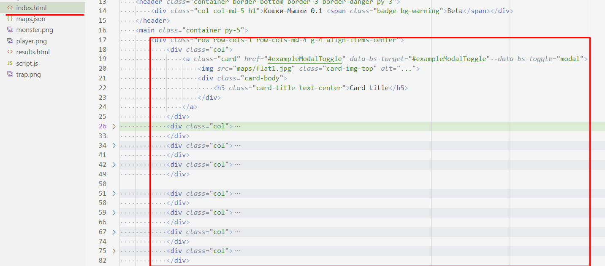
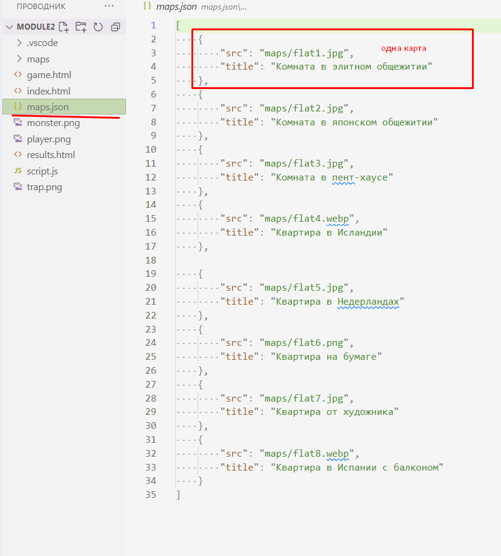

# 202202151147 Получение Информации о картах Игры. 2 Модуль WorldSkill 1.3

[Разбор модуля 2 по WorldSkills](202202150946-WS-module-2.md)

## Дано (Цель)

Мы начинаем с Экрана выбора карт. Здесь мы реализуем пункт:

> Карты должны браться из json-файла с помощью запроса

В скаченной пока верстке карты захардкожены в HTML:

Также, вместе с `index.html` рядом лежит json-файл с полным описанием карт и ссылок на их изображения:

**Цель:** Сделать загрузку файла maps.json в HTML-файле, и отобразить карты на
index.html в соответствии с полученными данными. Загружать файл мы будем с помощью
HTTP-запроса, который отправим вызвав [функцию fetch](202202101657-js-marathon-7.md).

## План действий

1. [Загрузим `maps.json` с помощью `fetch()`](202202151200-fetch-maps-json-module2-ws.md)
2. [Заполним экран с картами](202202151256-fill-choose-map-list.md)