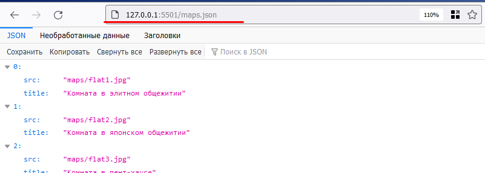
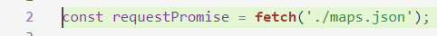
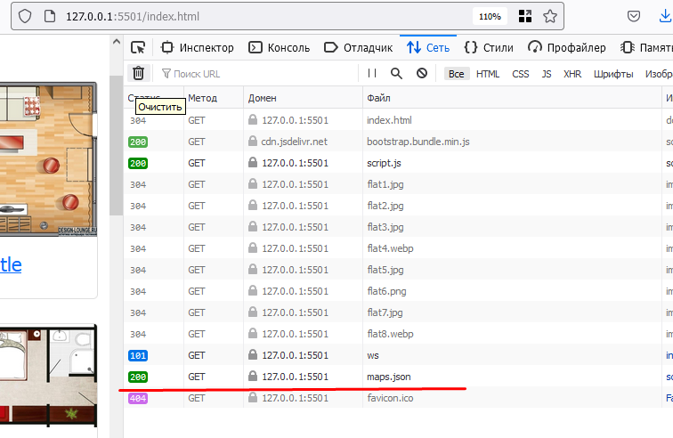
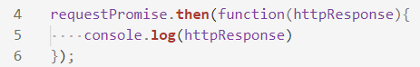
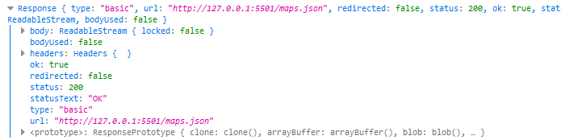
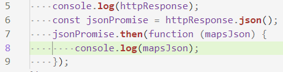
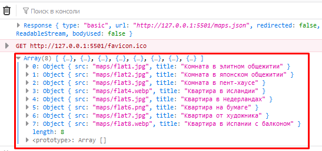

# 202202151200 fetch maps.json

Что-бы выполнить HTTP-запрос, наша HTML-страница должна быть на каком-нибудь простом
WEB/HTTP-сервере, иначе могут возникнуть ограничения браузера при попытке отправить запрос.

## Проверка доступности файла `maps.json` по HTTP

К счастью Live-Server - это и есть просто HTTP-сервер. И карта maps.json будет
доступна по HTTP точно также как и `index.html`:

Поэтому мы будем делать относительный запрос (относительно `index.html`) к
`./maps.json` (или просто `maps.json`):

Теперь, мы можем убедится в разделе отладки что HTTP-запрос выполнился:

## Отправка HTTP-запроса методом `fetch()`

Метод fetch не выполняет HTTP-запрос сразу, а говорит браузеру его сделать и
возвращает в JS объект `Promise`, то есть обещание, которое когда-нибудь будет
выполнено. Чтобы обработать результат `Promise-а` нам нужно зарегистрировать
колбэк (Функцию обратного вызова), который выполнится, когда браузер
совершит HTTP-запрос.

Делается это с помощью метода `.then(callback)`:

Обновляем страницу, смотрим результат в консоли:

## Получение JSON-данных в виде JavaScript-объекта (Парсинг JSON)

Чтобы из HTTP-ответа данные распарсились как JSON-объект есть метод `.json()`,
которые это сделает. Но он также возвращает `Promise`, поэтому код будет выглядеть так:

И проверка в консоли:

## Следующие шаги

1. Ура мы получили массив из JSON-файла запросом, теперь можем перейти к
[отображению карт на `Экране Выбора Карт`](202202151256-fill-choose-map-list.md).
2. В данном примере мы сделали работу на `Promise` в учебных целях, стоит
прочитать про них подробнее и перейти на `async/await`. См [JS-Марафон. 8 день](202202151313-js-marathon-8.md)

## Навигация

- [WorldSkills. Модуль 2. Программирование на стороне Клиента](202202150946-WS-module-2.md)
    - Следующее: [Заполнение списка карт, полученной информацией](202202151256-fill-choose-map-list.md)
    - Предыдущее: [Получение Информации о картах Игры](202202151147-fetch-maps-Module-2-WS.md)
