# 202202151256 Заполнение экрана Выбора Карт

Продолжаем разбираться в этапе [Получения Информации о картах Игры](202202151147-fetch-maps-Module-2-WS.md).

На прошлом этапе мы [получили maps.json](202202151200-fetch-maps-json-module2-ws.md),
сейчас нам нужно отобразить информацию о картах на странице в виде карточек.

## Находим верстку карточки

1. Рассмотрим `index.html` и найдем HTML-код одной карточки, а также найдем
какую информацию нам нужно туда подставить. В нашем случае, это картинка (`src`)
и название карты (в нескольких местах):

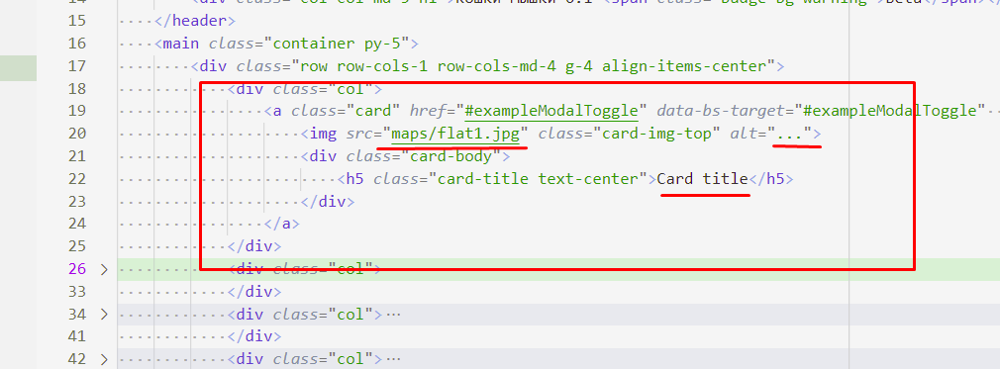

2. В HTML-коде карточки есть часть непонятных атрибутов, которые нам вроде как
и не нужны. Верстальщик спешил и просто копировал верстку с BootStrap-а.
Поэтому мы можем пока убрать её:

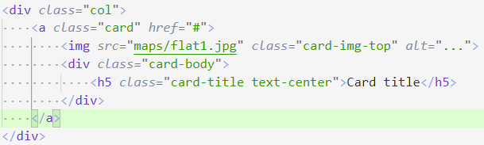

3. На самом деле, мы убрали HTML-аттрибуты для работы с модальным окном
в BootStrap. Мы его будем [делать по-другому](202202181645-login-form-m2-ws.md),
но и с [модальными окнами BootStrap](202202151358-modal-window-wth-Bootstrap.md)
было бы неплохо разобраться.

## Создаем функцию по генерации HTML-кода одной карточки

1. Возьмем HTML-верстку одной карточки, и создадим в файле `script.js` функцию, которая из объекта возвращает строку-HTML верстку:

    > Обратите внимание!
    > Мы использовали [многострочные строки](https://learn.javascript.ru/string#kavychki) с обратной кавычкой (\`), которая располагается под буквой `ё`.

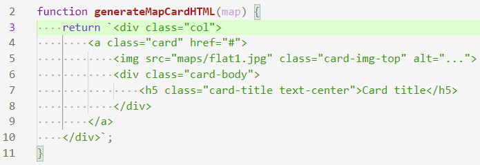

2. Проверим в консоли Браузера, что функция работает:

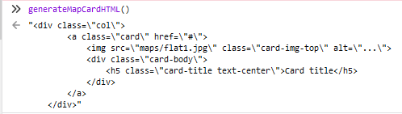

3. Теперь воспользуемся особенностью многострочных строк JavaScript - [интерполяцией](202202151547-interpolation.md). Для этого внутри строки используем синтаксис `${VariableName}`:

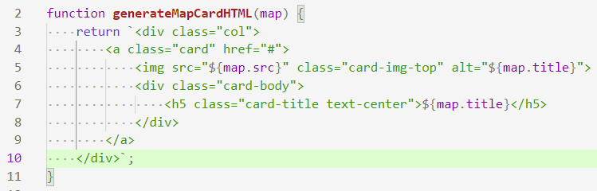

4. Проверяем в консоли, что значения подставляются:

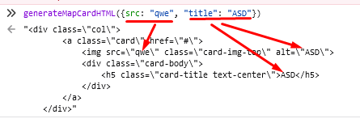

5. Можем несколько упростить код, воспользовавшись [Деструктуризацией аргументов функций](https://learn.javascript.ru/destructuring-assignment#umnye-parametry-funktsiy):

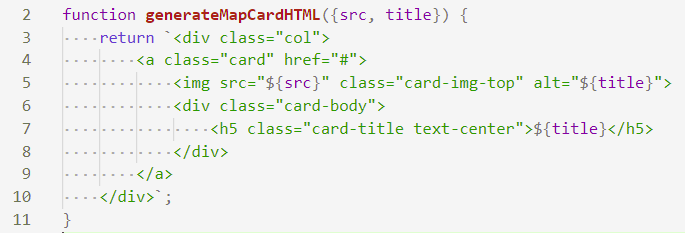

6. Не забываем проверить, что ничего не сломалось и все работает также

## Генерирование списка HTML-карточек

1. Теперь сделаем функцию, которая принимает массив карт и возвращает HTML-верстку для всего массива.

2. Это можно сделать с помощью написанной нами ранее функции `generateMapCardHTML()` и [JavaScript-циклов](https://learn.javascript.ru/while-for#tsikl-for):

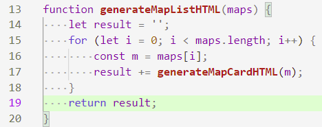

2. Попробуем в консоли разработчика, убедившись что все работает:

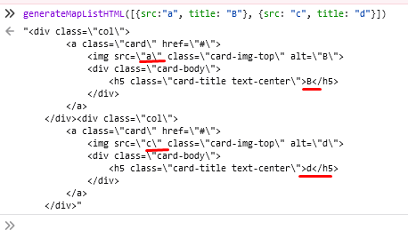

3. Так же, можем сократить код используя [JS-метод массива `.map()`](https://learn.javascript.ru/array-methods#map), который принимает функцию и применяет к каждому элементу массива эту функцию. После массив HTML-карточек можно соединить с помощью [метода массива `.join("")`](https://developer.mozilla.org/ru/docs/Web/JavaScript/Reference/Global_Objects/Array/join):

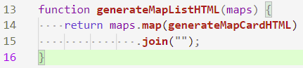

4. Не забываем проверить, что ничего не сломалось и все работает также

## Размещение списка HTML-карточек на Экране Выбора Карт

1. Сгенерировав HTML-код списка карточек нам осталось вставить его в документ.

2. Для начала найдем в `index.html`, где были захардкожены эти карточки.
Больше нам они особо нам не нужны, поэтому можем их *удалить* (или *закомментировать*), и чтобы найти HTML-элемент куда будем добавлять список, обозначим его классом `choose-map-screen`:

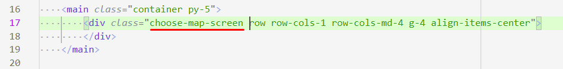

2. С помощью метода `document.querySelector()` найдем наш HTML-элемент в нашем JS-файле. Чтобы проверить что он нашелся и не равен `null` (так будет если мы где-то опечатались и `.querySelector()` не смог найти элемент), мы добавим ключевое слово `debugger`. Увидев его, отладчик остановит нашу программу именно на этом месте, и мы сможем проверить значение переменной:

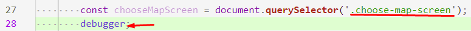

3. Проверяем в Инструментах разработчика:

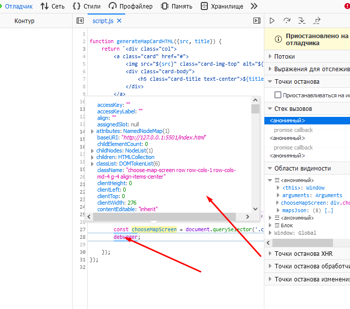

4. Отлично, осталось добавить в `.innerHTML` наш сгенерированный HTML:

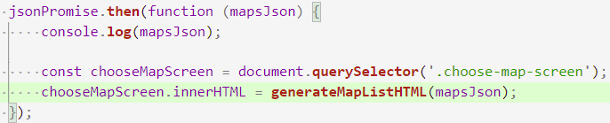

5. Проверяем в браузере, что все работает:

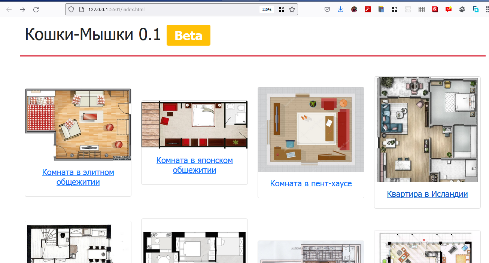

## Навигация

- [WorldSkills. Модуль 2. Программирование на стороне Клиента](202202150946-WS-module-2.md)
    - Следующее: [Переключение Экранов Игры](202202151333-change-screen.md)
    - Предыдущее: [Использование fetch](202202151200-fetch-maps-json-module2-ws.md)
