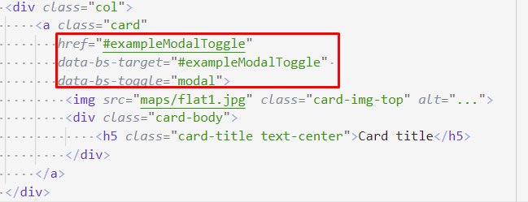
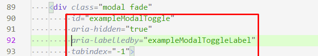
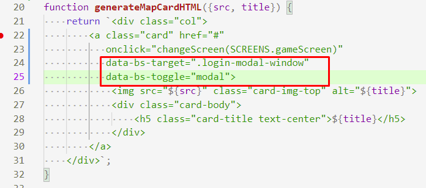
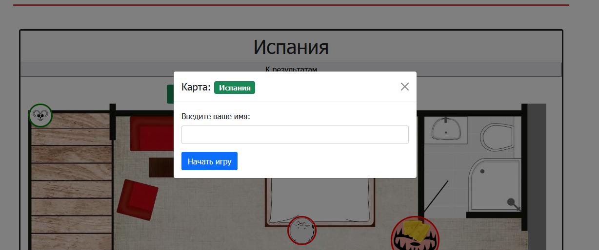

# 202202151358 Модальное окно с помощью Bootstrap

Что бы реализовать [ввод имени](202202181645-login-form-m2-ws.md)
нам в первую очередь нужно показать форму, где его можно будет ввести.
Для Этого в изначальной верстке есть модальное окно. Которое даже работало за счет JS-скриптов Bootstrap-а и соответствующих атрибутов:

1. Так выглядит карточка с картой: 
    1. `href=#....` - в целом, обычная якорная ссылка к элементу с соответствующим `id`. Возможно, сделана для совместимости, мало ли JS на странице будет отключен? Тогда, браузеру необходимо будет промотать страницу к форме.
    2. `data-*` аттрибуты служат для того, чтобы добавить к `DOM`-элементу дополнительную информацию. Префикс `-bs-` говорит о том, что данные атрибуты для Bootstrap-а. `-
    `data-bs-target` - видимо, селектор модального окна, которое мы хотим открыть, а `data-bs-toggle` говорит нам о переключении, или типе переключения, которое должно произойти. Видимо, здесь хранится информация о том, что должен произойти показ модального окна.
2. Аттрибуты же самого окна, на самом деле сейчас роли для нас не играют: . Нам главным образом интересен такой же `id`, как
и в`data-bs-target`, `aria-*` же атрибуты мы рассмотрим позже, либо можно
изучить их [самостоятельно](https://habr.com/ru/company/arcadia/blog/588118/),
как и атрибут `tabindex`.

## Что же мы будем с этим делать?

[На прошлых этапах](202202151256-fill-choose-map-list.md) мы отказались от тех
аттрибутов, так как не понимали зачем они были нужны. Теперь, мы можем попробовать
вернуть их, но с осознанием что нам достаточно вернуть `data-bs-*` атрибуты
с новыми значениями:

Обратите внимание, вместо `id`, мы указали свой `class` селектор на
тоже самое Bootstrap-окно. Проверяем, и да оно работает. И даже работают все стандартные механизмы Bootstrap (Закрытие модального окна по крестику, и закрытие окна при клике на темный фон):

## Навигация

- [WorldSkills. Модуль 2. Программирование на стороне Клиента](202202150946-WS-module-2.md)
    - Следующее: [Передача информации о выбранной карте в форму](202202190038-transit-data-to-modal-form-m2-WS.md)
    - Предыдущее: [Форма входа в игру](202202181645-login-form-m2-ws.md)

