# 202202161406 подготовка VM для тестирования WorldSkills

<div class="alert alert-warning h1 text-center">
    К сожалению Python Markdown транслятор плохо транслирует многострочный код,
    <a href="https://github.com/Suhoy95/webpy-alabuga/blob/main/zettelkasten/202202161406-WS-for-VM.md">
        Поэтому стоит читать эту страницу на GitHub
    </a>
</div>

## Настройка сервера SSH

> Стоит тестировать SSH-подключение без отключения SSH-соединения.
> Так как при ошибки конфигурации вы можете потерять доступ по SSH.

0. Конфигурационный файл: `/etc/ssh/sshd_config`
1. Только не забываем скопировать и проверить ssh-ключи (`ssh-copy-id`)
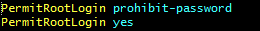
2.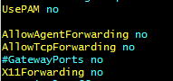
3. `systemctl reload sshd`
4. После того, как перепроверим, что всё работает сменим TCP-порт
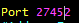

### Настройка сообщения входа

1. ` /etc/motd`
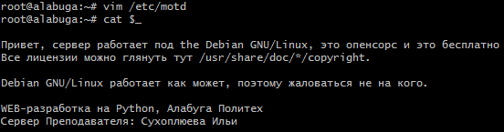
2. Установка `fortune`
3. ` apt install fortune-mod fortunes-ru fortunes`
4. `echo "/usr/games/fortune" >> /etc/bash.bashrc`
5. 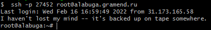

## Генерация списка студентов и паролей

```bash
for i in `seq 0 25`; do
    echo "std${i}";
    (tr -dc A-Za-z0-9 </dev/urandom | head -c 13 ; echo '') > "std${i}_password".txt
done > students.txt
head students.txt
std1
std2
std3
std4
std5
std6
std7
std8
std9
std10
```

## Создание Пользователей для Участников WS

```bash
for i in `seq 0 25`; do
/usr/sbin/useradd -m "std${i}"
cat "std${i}_password".txt "std${i}_password".txt | passwd "std${i}"
done
```

## Установка и настройка nginx

```bash
apt-get install nginx
systemctl status nginx
```

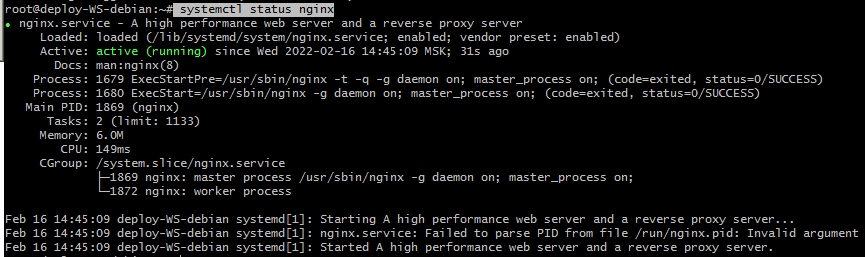

### Настройка nginx для Module2 (HTML/JS)

1. Сгенерируем базовый конфиг:

```bash
echo "" > /etc/nginx/sites-enabled/jan.ws.conf
for i in `seq 0 25`; do
cat >> /etc/nginx/sites-enabled/jan.ws.conf <<HERE
server {
        listen 80;
        listen [::]:80;
        server_name std${i}.gramend.ru;

        root /home/std${i}/jan/module1;
        index index.html index.htm index;

        location /.well-known/ {
            root /var/www/acme/;
            try_files \$uri \$uri/ =404;
        }

        location / {
            try_files \$uri \$uri/ =404;
        }
}
HERE
done
```
2. Проверим, что nginx работает как нужно:

```
nginx -t # Проверяем что файл конфигурации ОК
systemctl reload nginx # Перезагрузка конфигурации

for i in `seq 0 25`; do
    mkdir -p "/home/std${i}/jan/module1/"
    echo "<h1>Hello, std${i}" > "/home/std${i}/jan/module1/index.html"
done
```

3. Выборочно проверяем:

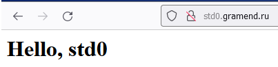
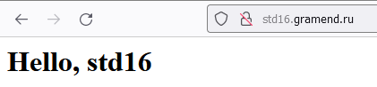
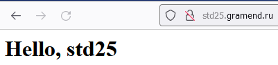

### Настройка HTTPS

0. Не забываем добавить к `/etc/nginx/sites-enabled/default`, чтобы пока не настроенная `alabuga.gramend.ru` тоже прошла WEB-root аутентификацию:
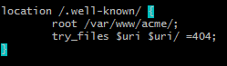
1. Будем устанавливать бесплатные HTTPS-сертификаты let's Encrypt, с этим нам поможет [https://certbot.eff.org/](https://certbot.eff.org/)
2. `apt-get install certbot`
3.

```bash
certbot certonly --dry-run \
                 --nginx \
                 -w /var/www/acme/ \
                 --expand -d alabuga.gramend.ru \
                          -d std0.gramend.ru \
                          -d std1.gramend.ru \
                          -d std2.gramend.ru \
                          -d std3.gramend.ru \
                          -d std4.gramend.ru \
                          -d std5.gramend.ru \
                          -d std6.gramend.ru \
                          -d std7.gramend.ru \
                          -d std8.gramend.ru \
                          -d std9.gramend.ru \
                          -d std10.gramend.ru \
                          -d std11.gramend.ru \
                          -d std12.gramend.ru \
                          -d std13.gramend.ru \
                          -d std14.gramend.ru \
                          -d std15.gramend.ru \
                          -d std16.gramend.ru \
                          -d std17.gramend.ru \
                          -d std18.gramend.ru \
                          -d std19.gramend.ru \
                          -d std20.gramend.ru \
                          -d std21.gramend.ru \
                          -d std22.gramend.ru \
                          -d std23.gramend.ru \
                          -d std24.gramend.ru \
                          -d std25.gramend.ru
```
4. Успех:
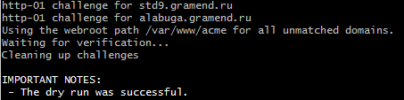
5. Теперь можем выпустить SSL-сертификаты, запустив верхнюю команду без `--dry-run`
6. Отлично, теперь у нас есть сертификат на все сайты:
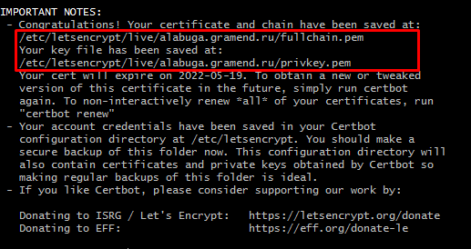
7. Теперь, переделываем конфигурацию на HTTPS-only:

```bash
echo "" > /etc/nginx/sites-enabled/jan.ws.conf
for i in `seq 0 25`; do
cat >> /etc/nginx/sites-enabled/jan.ws.conf <<HERE
server {
    listen 80;
    listen 443 ssl;
    server_name std${i}.gramend.ru;

    ssl_certificate     /etc/letsencrypt/live/alabuga.gramend.ru/fullchain.pem;
    ssl_certificate_key /etc/letsencrypt/live/alabuga.gramend.ru/privkey.pem;
    include             /etc/letsencrypt/options-ssl-nginx.conf;
    ssl_dhparam         /etc/letsencrypt/ssl-dhparams.pem;

    root /home/std${i}/jan/module1;
    index index.html index.htm index;

    if (\$scheme != "https") {
        return 301 https://\$host\$request_uri;
    }

    location /.well-known/ {
        root /var/www/acme/;
        try_files \$uri \$uri/ =404;
    }

    location / {
        try_files \$uri \$uri/ =404;
    }
}
HERE
done
```
8. Работает:

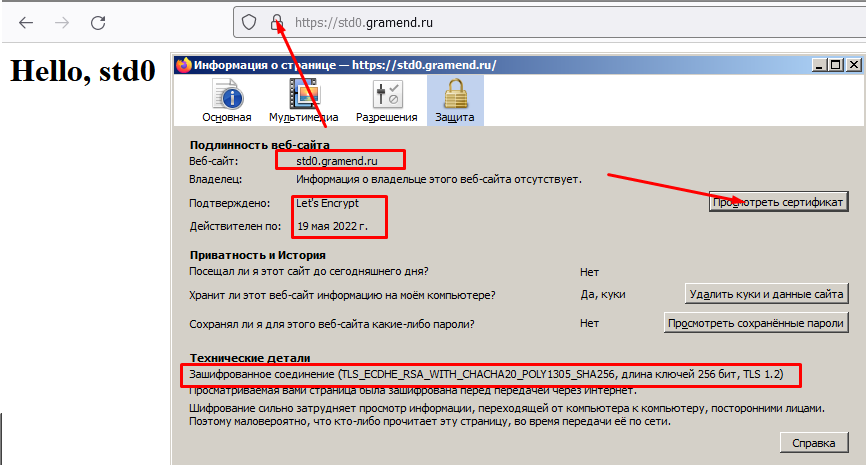

### Аутентификация HTTPS по паролю, чтобы студенты не подглядывали друг у друга

> Примечание: Никто не мешает студентам обменятся паролями и дать друг другу доступ,
> но в этом случае, ответственность за списывание будет на обоих. И штраф будет
> распространятся на обоих. Поэтому способные студенты заинтересованы, чтобы
> их работа не "утекала" к одногруппникам.

[Гайд: Restricting Access with HTTP Basic Authentication](https://docs.nginx.com/nginx/admin-guide/security-controls/configuring-http-basic-authentication/)

0. `apt install apache2-utils`
1. Генерируем `.htpasswd` для каждого студента :

```bash
mkdir -p auth
for i in `seq 0 25`; do
    cat "std${i}_password".txt | htpasswd -ci "auth/std${i}.htpasswd" "std${i}"
done
```

2. Обновляем nginx-конфигурацию:

```bash
echo "" > /etc/nginx/sites-enabled/jan.ws.conf
for i in `seq 0 25`; do
cat >> /etc/nginx/sites-enabled/jan.ws.conf <<HERE
server {
    listen 80;
    listen 443 ssl;
    server_name std${i}.gramend.ru;

    auth_basic           "std${i}’s Area";
    auth_basic_user_file /auth/std${i}.htpasswd;

    ssl_certificate     /etc/letsencrypt/live/alabuga.gramend.ru/fullchain.pem;
    ssl_certificate_key /etc/letsencrypt/live/alabuga.gramend.ru/privkey.pem;
    include             /etc/letsencrypt/options-ssl-nginx.conf;
    ssl_dhparam         /etc/letsencrypt/ssl-dhparams.pem;

    root /home/std${i}/jan/module1;
    index index.html index.htm index;

    if (\$scheme != "https") {
        return 301 https://\$host\$request_uri;
    }

    location /.well-known/ {
        root /var/www/acme/;
        try_files \$uri \$uri/ =404;
    }

    location / {
        try_files \$uri \$uri/ =404;
    }
}
HERE
done
```

3. Перезагружаем nginx, проверяем:

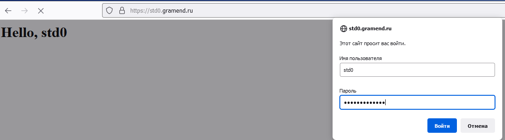

4. При проверке, пришлось переместить директорию с паролями, потому что nginx не мог открыть файлы в папке root:

```
cat /var/log/nginx/error.log
> 2022/02/18 11:54:29 [crit] 10456#10456: *984 open() "/root/std/auth/std0.htpasswd" failed (13: Permission denied), client: 31.173.165.58, server: std0.gramend.ru, request: "GET / HTTP/1.1", host: "std0.gramend.ru"

apt-get install sudo
sudo -u www-data cat auth/std0.htpasswd # так работает
sudo -u www-data cat /root/std/auth/std0.htpasswd # А так нет, кто бы мог подумать?
chown -R www-data:www-data auth/
chmod -R o-gr auth/
mv auth /auth
# + пересоздать конфиг с новыми путями
```

### TODO: Настройка nginx для Module1 (Django/Python)