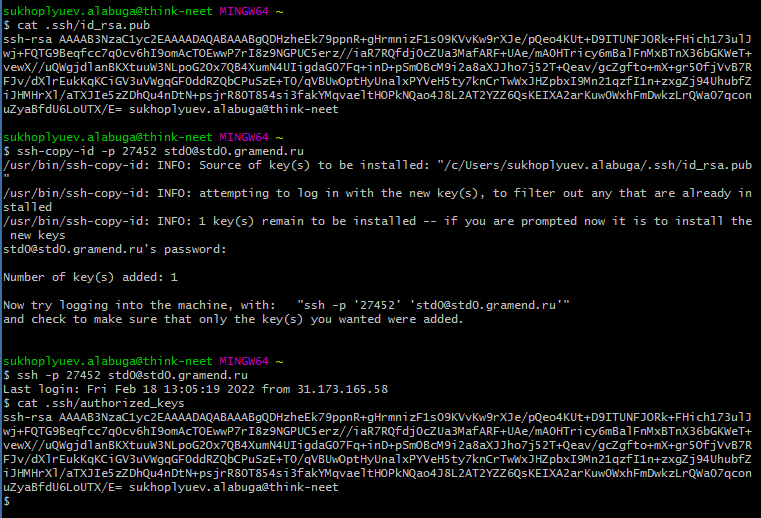
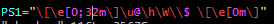
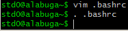
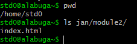
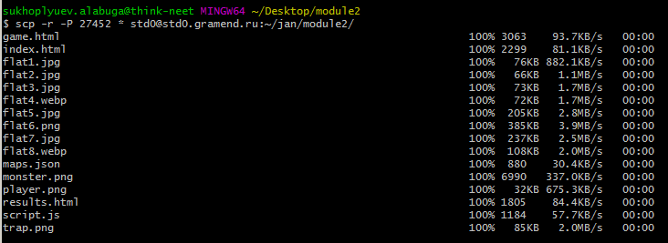
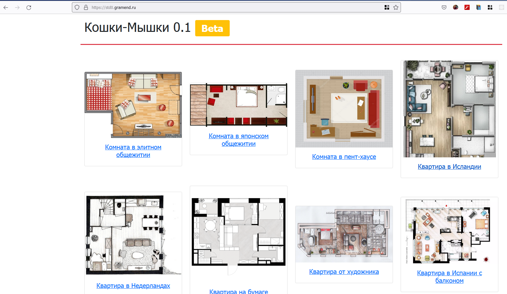

# 202202161616 Развертывание (deploy) статических файлов (HTML/CSS/JS) по **SSH**

## Описание / Цель

Любой КОД (задание для ДЭ) для WorldSkills подразумевает полный цикл, то есть
сделанный проект должен быть не просто сделан, а также выложен и доступен по
какому-то адресу.

Любое развертывание проекта начинается с
1) Подключения к серверу
2) Копировании файлов на сервер
3) Настройки WEB сервера и WEB-приложения (если требуется)

В нашем случае, WEB-сервер пока [настроен заранее](202202161406-WS-for-VM.md),
и сейчас мы на примере [Модуля 2](202202150946-WS-module-2.md) рассмотрим
как выложить наши статические файлы.

## Что потребуется

1. [GitBash for Windows](https://gitforwindows.org/) - имеет в коробке клиент ssh и сопутствующие утилиты.
2. Данные для входа:
    - `Hostname: std0.gramend.ru`
    - `Port SSH: 27452` (Сменен со стандартного `22`, чтобы избежать лишних случайных сканирований bot-программами)
    - `Username: std0`
    - `Password: ***********`
    - Папка куда нужно скопировать файлы: `/home/std0/jan/module2/`

## Шаги

### Подключение к серверу


1. Используем команду `ssh`, чтобы подключится:
    - `-p` - указываем TCP-порт на котором работает SSH сервер
    - до `@` указывается имя пользователя
    - после `@` указывает имя сервера
    - Для деталей лучше выучить [полную схему URL](https://ru.wikipedia.org/wiki/URL)
2. Сверяем отпечаток ключа сервера, так мы проверяем что подключаемся туда куда нужно:
```
ED25519 key fingerprint is SHA256:0wxSlgfhoASh/WioGHAOMBUYx2+1xR9LeSelhxUvW8k
```
3. Если все верно, пишем `yes`
4. И попадаем в терминал
5. Выйти можно по сочетанию клавиш `^D/ctrl+D`

### Подключение к серверу без пароля

Чтобы подключаться по SSH без ввода пароля, можно скопировать свой публичный ключ
`.ssh/id_rsa.pub` в `.ssh/authorized_keys` на сервер. Также для этого можно
воспользоваться утилитой `ssh-copy-id`:



### [Дополнительно] Настройка терминала сервера

Полезно настраивать переменные окружения Shell, среды. Одна из таких - `PS1`,
которая отвечает за строку-приглашение. Как минимум,
полезно делать имя пользователя/компьютера разными цветами, чтобы случайно
не перепутать сервера, с которыми ты работаешь.

Делается это, с помощью файла .bashrc, который выполняется при входе:





### Копирование статических файлов

1. Проверяем что папка существует (если нет, придется её создать `mkdir -p`):




2. Пользуемся `scp`, чтобы скопировать файлы:




### Проверка

Заходим на `std0.gramend.ru`, вводим те же имя пользователя и пароль (HTTP базовая авторизация)
и убеждаемся, что все работает:



## Заметки

1. Стоит сделать какой-то скрипт для автоматической загрузки страницы на HTTP-сервер,
чтобы быстро исправлять ошибки и перезагружать новую версию на сервер.
2. Можно даже сделать это при коммите, например (Совет для WorldSkill!, в реальной жизни авто-деплой стоит реализовывать сложнее)