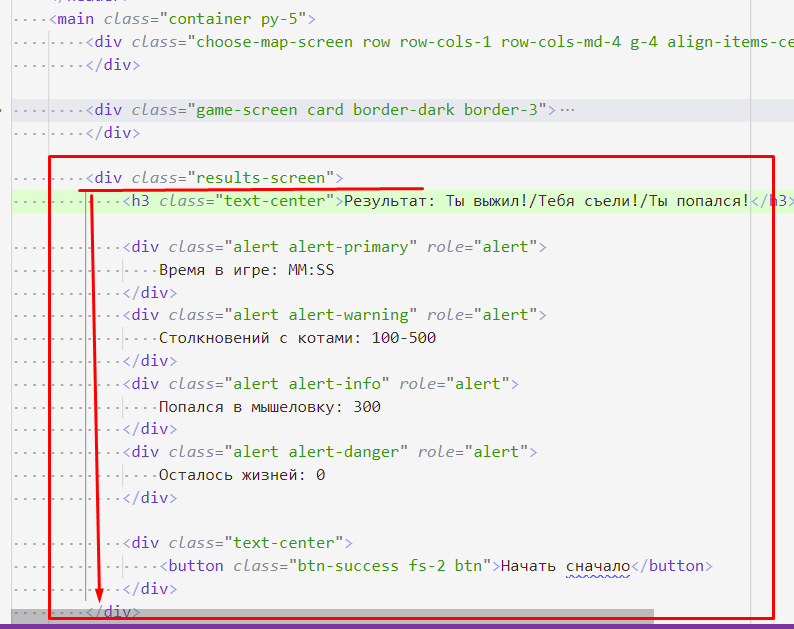

# 202202181553 Подготовка HTML-верстки. Переключение экранов игры. Модуль 2

## Поиск различий в верстке

1. Нам пришло 3 файла: `index.html`, `game.html`, `results.html`. Посмотрим,
на них внимательно, и поймем какая часть верстки относится к экрану, а
какая - повторяющийся шаблон:

2. Как мы видим, основной экран расположен в теге `<main>`, и дополнительные
скрытые всплывающие окна расположены за ним. Пы разместим все три экрана в
`index.html` и будем переключать их видимость в JavaScript в зависимости
от действий пользователя.
3. Перенесем верстку экрана игры:

4. Чтобы различать и находить в JS эти различные части верстки, данные узлы
стоит как-то обозначить. Это можно делать через аттрибут `id`, или
придумать какой-нибудь уникальный `class` для экранов (мы сделаем так):

5. С экраном Результатов все чуть сложнее, там все верстка размещена в `<main>`
и мы не можем её так просто перенести как один HTML-узел. Выход есть - можем
завернуть в ещё один `
`. Главное - убедится, что это не ломает верстку:

6. Зайдем в инструменты разработки, и проверим верстку. Скрыв экраны входа и игры:

7. Отлично, осталось скрыть экраны Игры и Результатов, которые не должны
быть видны после загрузки страницы:

## Следующий шаг

Теперь мы сделаем [функцию смены экрана](202202181614-from-maps-to-game.md), и сделаем переход на игру, пока без ввода
имени пользователя.
