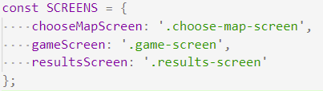
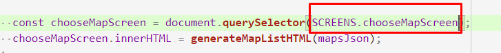
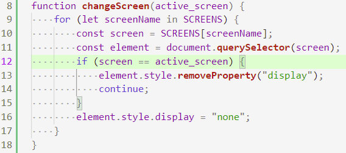
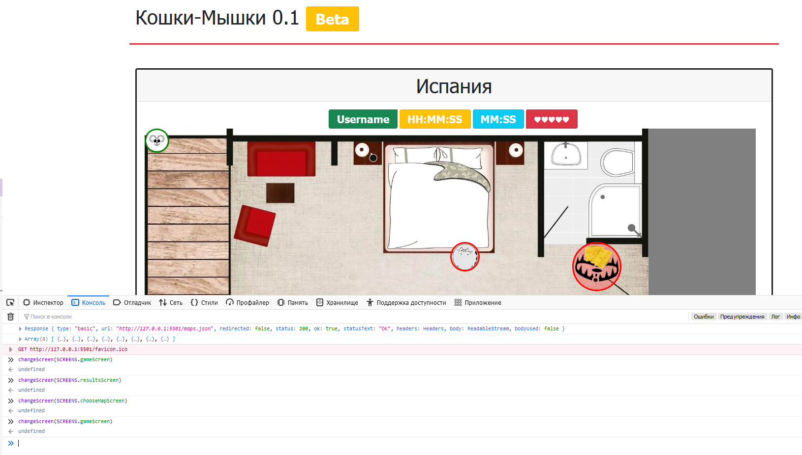
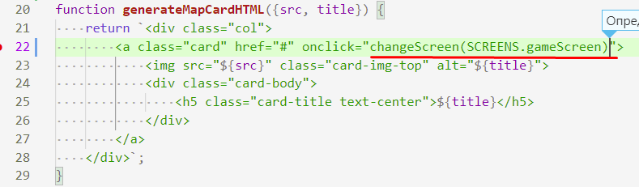

# 202202181614 Переключение с `Экрана Выбора Карты` на `Экран Игры`

1. Для начала обозначим [классы экранов](202202181553-html-cs-m2-ws.md), по которым мы будем искать экраны, в виде констант:

2. Теперь стоит их использовать даже в коде предыдущего шага:

3. Напишем функцию, которая будет принимать в виде аргумента строку-активный экран.
Включать активный, и отключать неактивный:

4. Проверяем:

5. Теперь сделаем так, чтобы при клике на карту мы переходили на экран Игры:

6. Не забываем перепроверить, и перейти [к следующим шагам](202202181645-login-form-m2-ws.md).