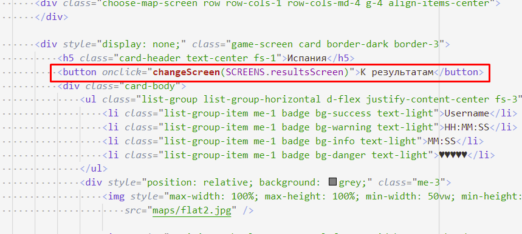
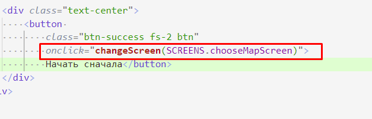

# 202202181637 Переключение с `Экрана Игры` на `Экран Результатов`, c `Экрана Результатов` на `Экран Выбора Карты`

На самом деле, мы можем воспользоваться [тем же трюком](202202181614-from-maps-to-game.md), и просто вызвать нашу
функцию в HTML.

1. Для ухода с экрана Игры на результаты придется вписать кнопку для тестирования:

2. А на экране результатов, эта кнопка уже есть:

3. Ура! Должно работать. Не забываем перепроверить.

## Навигация

- [WorldSkills. Модуль 2. Программирование на стороне Клиента](202202150946-WS-module-2.md)
    - Следующее: [Форма входа в игру](202202181645-login-form-m2-ws.md)
    - Предыдущее: [Переключение с `Экрана Выбора Карты` на `Экран Игры`](202202181614-from-maps-to-game.md)