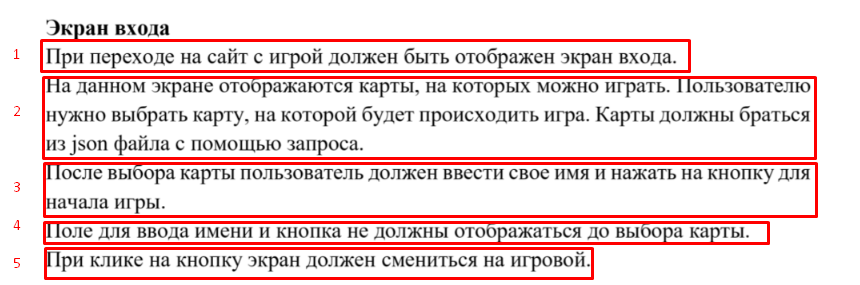

# 202202181645 Форма входа в игру / Модальное окно с формой

## Цели и задачи

Перечитаем [ТЗ](202202151120-KOD1-3-Module-2.pdf) касательно экрана входа:

1. Первый пункт у нас выполняется, можно сказать, по-умолчанию: как только
мы [выложим на сервер](202202161615-deploy-Module2.md) `index.html` - `Экран с выбором карты` - это первое, что
будет загружаться у пользователя.
2. Второй пункт, мы сделали [в самом начале](202202151147-fetch-maps-Module-2-WS.md).
3. Третий пункт в верстке представлен в виде всплывающего Bootstrap-окна. Нам
осталось только описать логику его работы на JavaScript.
4. Четвертый пункт выполняется по-умолчанию, осталось только разобраться,
как именно форма скрыта и сообразить как её показать.
5. Пятый пункт мы реализовали [на предыдущем шаге](202202151333-change-screen.md).

## План действий

1. [Разобраться как можно показать Модальное окно Bootstrap](202202151358-modal-window-wth-Bootstrap.md)
2. [Передать информацию о выбранной карте в форму](202202190038-transit-data-to-modal-form-m2-WS.md)
3. Проверить, что [имя пользователя введено корректно (Провалидировать форму)](202202190137-login-form-validation.md).
4. [Переключиться на экран Игры, передав игре всю начальную информацию, введенную пользователем (Карту, её название и имя пользователя)](202202190215-submit-login-form-m2-ws.md).
