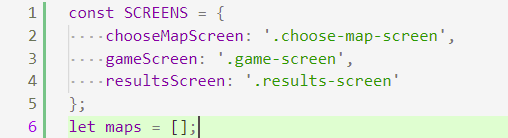
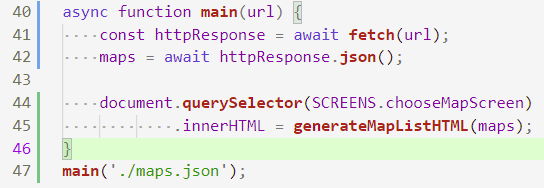
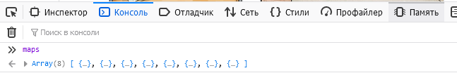
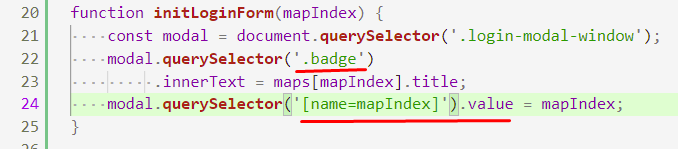
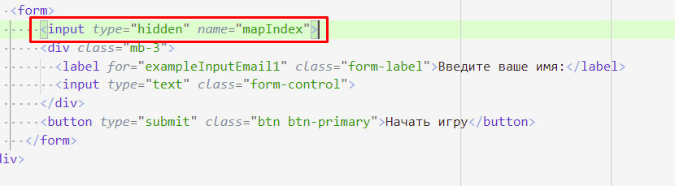
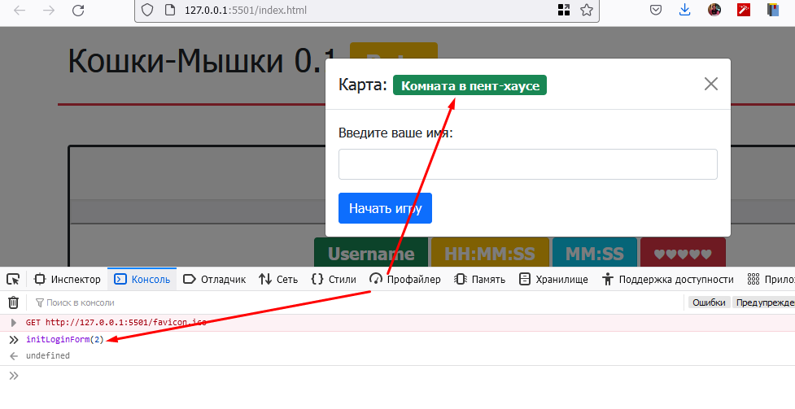
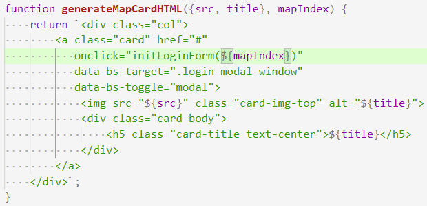
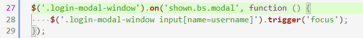
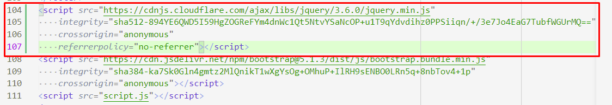

# 202202190038 Передача информации о выбранной карте в форму Модального окна входа

Второй этап реализации [формы входа](202202181645-login-form-m2-ws.md),
[второго модуля по WorldSkills КОД 1.3](202202150946-WS-module-2.md).

На предыдущем шаге мы разобрались с [открытием Модального окна в bootstrap](202202151358-modal-window-wth-Bootstrap.md), теперь пора проинициализировать
эту форму в соответствии с тем, на какую карту нажал пользователь.

## Идея

На самом деле, вся информация о картах, хранится в JSON-массиве, который
приходит к нам с сервера. Если бы мы хранили его в виде, какой-то переменной,
то при генерации списка карт мы могли бы вызывать функцию инициализации модального
окна, в которую просто передадим индекс карты в этом массиве.

## Реализация

1. Объявим переменную для списка карт. Обратите внимание, все более-менее
глобальные переменные мы объявляем сверху в одном месте. В этом даже есть
какой-то тайный смысл:

2. Перепишем загрузку карт на `async/await`, а также проинициализируем нашу
переменную загруженным списком карт:

3. Проверим, что теперь массив списка карт доступен в консоли:

4. Теперь напишем функцию, которая будет принимать индекс в этом массиве
и инициализирует форму входа:

5. Как мы можем заметить по функции, мы делаем две вещи:
    1. Подставляем в значок имя карты. (**Если бы в форме было больше одного `.badge`, пришлось бы придумывать или назначать какой-нибудь свой селектор**).
    2. Сохраняем `mapIndex` в `input`-е формы. Для этого его нужно прописать в форме, а чтобы он не был виден, в HTML есть специальный `type=hidden`: 

6. Теперь зайдем в браузер, откроем модальное окно. И по-вызываем нашу функцию,
убедившись, что значок и значение в форме действительно меняются:

7. Отлично, теперь осталось изменить обработку клика на карточку с картой:

8. На удивление, все будет сразу работать, если мы использовали метод [`.map`](https://developer.mozilla.org/en-US/docs/Web/JavaScript/Reference/Global_Objects/Array/map), ведь он как раз передает
индекс элемента вторым аргументом.

9. Последним моментом, было бы неплохо, делать так, чтобы пользователь сразу
мог приступать к вводу имени, для этого на `input` потребуется активировать фокус.
К сожалению, пока модальное окно не показалось нативное использование [`focus/blur`](https://learn.javascript.ru/focus-blur) не работает. Придется, воспользоваться советом с сайта [Bootstrap Modal](https://getbootstrap.com/docs/4.0/components/modal/), а для этого также придется подключить [jQuery с CDN](https://cdnjs.com/libraries/jquery):

## Следующие шаги

Теперь, обработаем ввод формы, [убедившись что имя пользователя введено корректно](202202190137-login-form-validation.md).