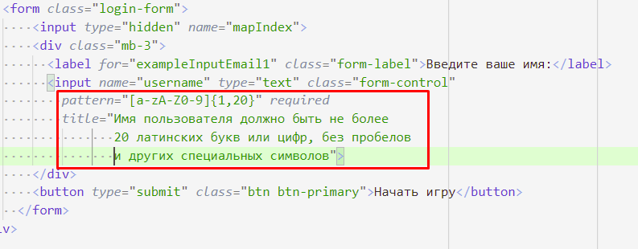
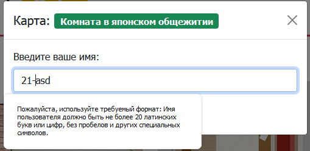

# 202202190137 Валидация формы ввода Имени пользователя

Третий этап реализации [формы входа](202202181645-login-form-m2-ws.md),
[второго модуля по WorldSkills КОД 1.3](202202150946-WS-module-2.md).

1. В последних версиях HTML5 у input-ов появилось много полезных атрибутов для
валидирования формы на стороне клиента:
    - Чтобы пользователь не указал пустое имя, нам поможет атрибут
    `required` - говорящий браузеру, что данное поле обязательно для заполнения
    - Чтобы пользователь вводил только буквы/цифры и не более 20-ти,
    мы можем воспользоваться атрибутом `pattern`, указывающим регулярное выражение,
    которому должно соответствовать введенное значение
    - Чтобы при валидации возникала понятное пользователю описание, что нужно ввести в это поле
    нам поможет атрибут title.

2. Проверяем:

## Навигация

- [WorldSkills. Модуль 2. Программирование на стороне Клиента](202202150946-WS-module-2.md)
    - Следующее: [Обработка отправки формы](202202190215-submit-login-form-m2-ws.md)
    - Предыдущее: [Передача информации о выбранной карте в форму](202202190038-transit-data-to-modal-form-m2-WS.md)
