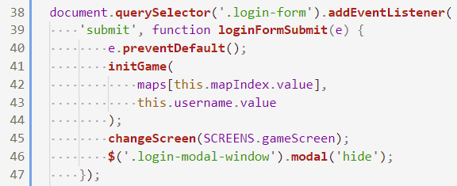
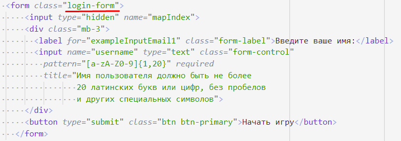
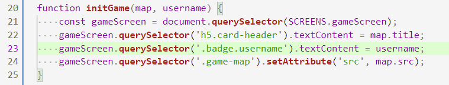
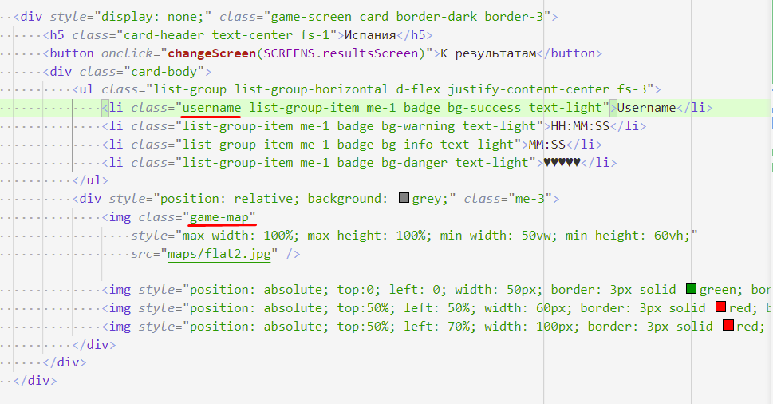

# 202202190215 Обработка отправки формы, переход на экран игры

Четвертый этап реализации [формы входа](202202181645-login-form-m2-ws.md),
[второго модуля по WorldSkills КОД 1.3](202202150946-WS-module-2.md).

Функция, которая обрабатывает [отправку (`submit`) формы](https://learn.javascript.ru/forms-submit).

- Чтобы браузер не перезагрузил страницу, нужно вызвать `.preventDefault()` у объекта события.
- Из узла формы (сейчас `this` указывает на него) нужно передать информацию о карте
и имени пользователя. Мы передаем её в функцию `initGame()`, где и произойдет
инициализация карты.
- Остается переключить экран и спрятать модальное окно для Ввода пользователя.

Чтобы это все работало, нужно не забыть добавить соответствующие классы в HTML:

Про инициализацию формы мы поговорим дальше, но для чернового варианта
мы можем изменить фон, название карты и имя пользователя в соответствии с переданной
информацией:

Только нужно не забыть обозначить новые узлы именами:

Теперь, можем перейти к [написанию самой игры](202202190235-game-screen-m2-ws.md)
