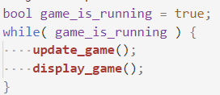

# 202202190235 Реализация `Экрана Игры`

## Цель

Настало время заняться самым важным во `Втором модуле` - реализация логики игры.

Весь код любой игры, очень грубо и абстрактно можно было бы описать следующим видом:

Где:

1. `update_game()` - код, который обрабатывает сигналы от пользователя,
а также обновляет игровые события (в нашем случае: движение монстров,
генерация монстров и ловушек, обработка столкновений)
2. `display_game()` - код, который возьмет Модель игры, и покажет её пользователю. Важно отметить, что **логику игры и механику, мы в целом могли бы писать и без внешнего вида**. Другое дело, что играть в то, что не видно особо не получится, а вот программировать и делить код и задачи так легче ;).

В случае Браузера и JavaScript дела обстоят чуть интереснее: весь JS и так обрабатывается в [Бесконечном событийном цикле](https://learn.javascript.ru/event-loop), нам остается к началу игры правильно проинициализировать значения и назначить функции которые будут обрабатывать события от Пользователя. А периодически создавать монстров каждые `N`-секунд мы можем с помощью [setTimeout и setInterval](https://learn.javascript.ru/settimeout-setinterval).

## Шаги

1. [Модель/Состояние Игры](202203011636-model-game-m2-ws.md)
2. [Инициализация и Отображение Состояния Игры](202203011637-game-init-m2-ws.md)
3. [Движение Игрока](202203011642-player-move-m2-ws.md)
4. [Завершение игры при выходе через правую границу карты](202203011644-end-game-m2-ws.md)
5. [Генерация Ловушек](202203011645-trap-generation-m2-ws.md)
6. [Столкновение с Ловушками](202203011649-collision-with-monster-m2-ws.md)
7. [Генерация Монстров и Столкновение с Монстрами](202203011648-monster-generation-m2-ws.md)
8. [Постановка Игры на Паузу](202203011653-pause-screen-m2-ws.md)