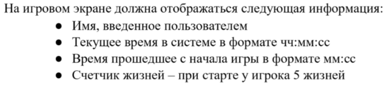
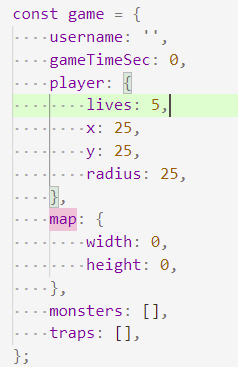
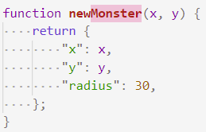
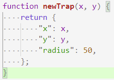

# 202203011636 Модель/Состояние Игры

Перед тем как начать писать логику игры, нужно определить какие данные там будут, и от каких параметров будет зависеть игра:

Во-первых, это те данные которые явно заданы в ТЗ:

Во-вторых нам понадобятся данные об:

1. Игроке (координаты, радиус и счетчик жизней)
2. Монстрах (массив с координатами, радиус)
3. Ловушках (массив с координатами, радиус)
4. Границах/размерах карты

## Общая модель (состояние) игры

Минимальный вариант получается такой:

**Обратите внимание**: мы не храним системное время, так как оно и так хранится в системе, и мы можем его просто выводить напрямую.

## Функции для создания Монстров и Ловушек

Параметры игрока были заданы ещё в общей модели. А вот параметры монстров и ловушек - нет. Так как они будут добавляться позже. Однако мы можем оформить их создание в функции, где зададим радиус, который не будет меняться в игре:

## Навигация

- [WorldSkills. Модуль 2. Программирование на стороне Клиента](202202150946-WS-module-2.md)
    - Следующее: [Инициализация и Отображение Состояния Игры](202203011637-game-init-m2-ws.md)
    - Предыдущее: [Реализация `Экрана Игры`](202202190235-game-screen-m2-ws.md)

