# 202203011637 Инициализация и Отображение Состояния Игры

## Задание начальных значений

Описав [Модель игры](202203011636-model-game-m2-ws.md), теперь мы можем
перейти к отображению этой модели на экране. Но перед этим,
как [в задачке про Буратино]() мы должны задать игровой модели начальное значение.

1. Некоторые параметры можно задать постоянными, например время отсчета игры
и жизни игрока сбросится до начальных значений:

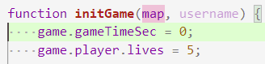

2. Некоторые мы получим из аргументов в самом начале игры, например - имя игрока:

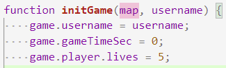

3. Определенной сложностью является инициализация размеров карты. Пока мы не установили требуемую карту в HTML верстку, мы не знаем какие размеры карты будут вычислены (они задаются CSS-свойствами, относительно экрана, см [Единицы измерения](https://learn.javascript.ru/css-units)):

4. Поэтому нам сначала нужно задать узлу карты нужное значение `src`:

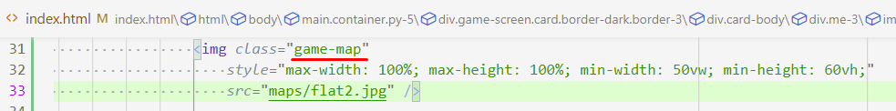

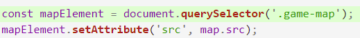

5. А теперь можем взять [вычисленные значения](https://learn.javascript.ru/size-and-scroll). В нашем случае правильнее всего взять `offsetWidth/Height`:

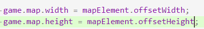

6. И можем проверить, что мы точно взяли верные вычисленные значения:

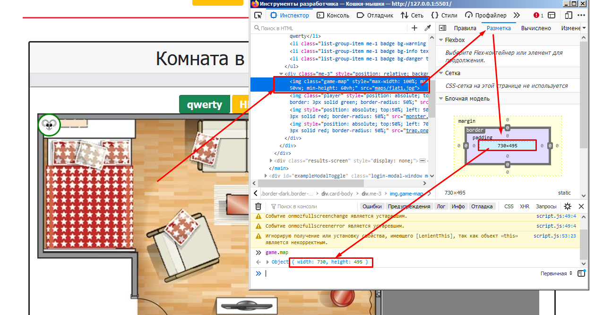

7. **Внимание!!!** Если вы все делали верно, то вместо результата выше - размеры карты должны быть `{width: 0, height: 0}`. Все дело в том, что размер картинки не будет вычислен, пока картинка не отобразиться в браузере. Поэтому, инициализацию карты стоит делать после отображения карты, а не до (как мы сделали сначала):

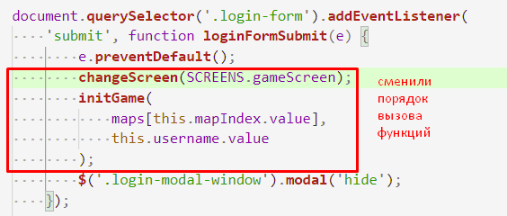

8. С положением игрока не все так очевидно: в задании сказано, что цель игрока дойти до конца карты. Но вот где этот конец - не понятно. *Возможно, в оригинальном задании это могло быть видно исходя из верстки и медиа-файлов*. Но в нашем случае, и это не очевидно, как не очевиден факт, откуда игрок должен начинать игру. Поэтому: определим, что игрок будет начинать слева карты по середине, а заканчивать при пересечении правой границы. Определившись, мы можем задать позицию игроку используя уже полученные нами значения ширины и высоты карты:

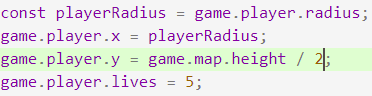

9. **Обрати внимание!!!** строки кода инициализации игрока был объеденины в одном месте, чтобы его было проще найти.

10. Проверить правильность координат мы пока можем только в консоли:

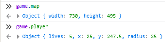

## Отображение Модели Игры

Рассматривая `Экран Игры` и примитивный игровой цикл, рассмотренный [в начале](202203011636-model-game-m2-ws.md), нужно осознать и заметить один неучтенный факт: есть данные игры, которые на эркане можно зафиксировать с самого начала игры:

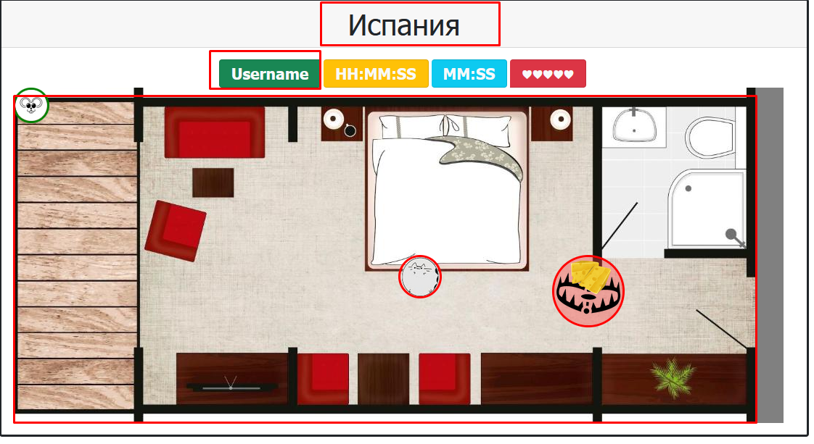

А есть те, которые будут меняться вместе с тем, как будет меняться модель игры:

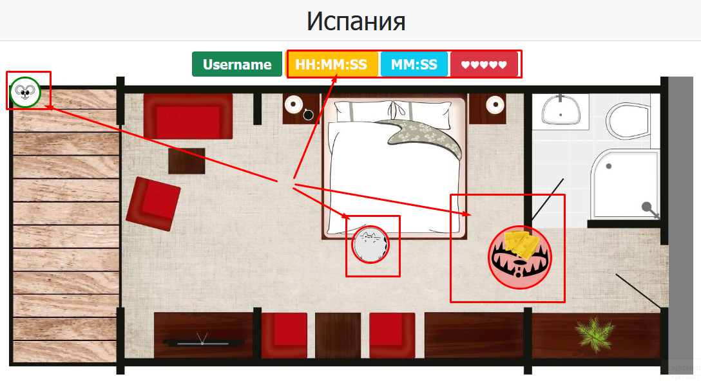

### Отображение данных при инициализации

Данный код отображения игры будет выполнятся единожды, и только при **инициализации игры**. Поэтому, его даже не требуется выделять в отдельную функцию.

На самом деле, мы уже написали эту часть на прошлых этапах. Остается ее повторить

1. Отображение названия карты и имени игрока (`initGame(map, username)`):

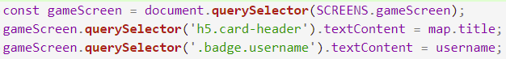

2. Отображение самой карты на заднем фоне игры (`initGame(map, username)`):

### Отображение регулярно обновляемых значений

1. Начнем с чего-нибудь простого: отобразим количество жизней, в зависимости от их количества в модели. Для этого найдем узел с жизнями и впишем туда столько сердец, сколько у нас в модели:

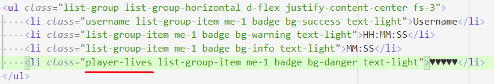

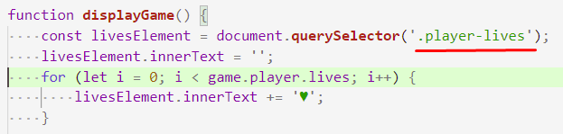

2. Что бы проверить, что все работает, мы можем поменять значение жизней вручную и пере-вызвать `displayGame()`:

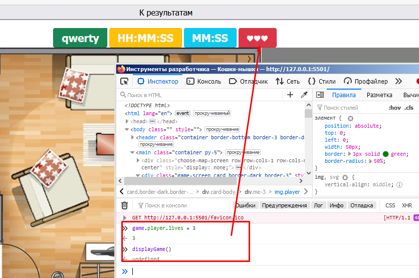

3. Таким же образом, мы можем отобразить игровое время, только для начала потребуется воспользоваться операторами деления, чтобы из общего числа секунд получить минуты и секунды:

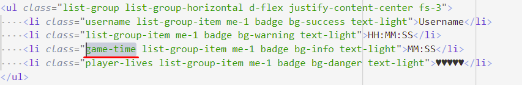

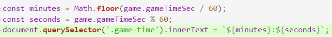

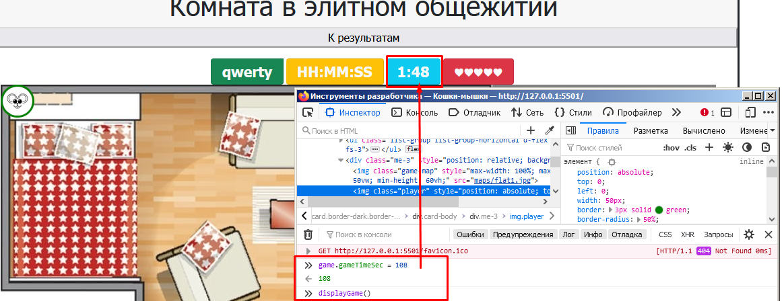

4. Можно заметить, что значение не соответствует формату: **ЧЧ:ММ**. Для этого можно сделать вспомогательную функцию:

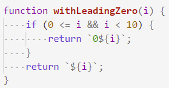

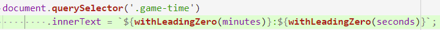

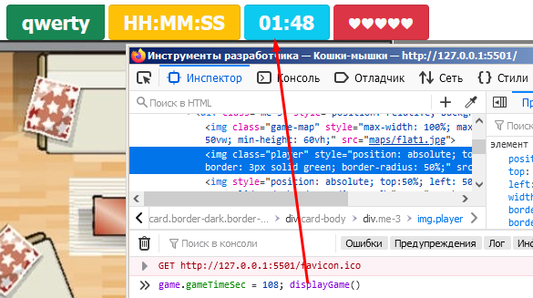

5. Для получения системного времени, мы можем воспользоваться [`new Date()`](https://learn.javascript.ru/date) и нашей вспомогательной функцией:

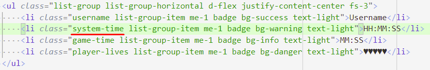

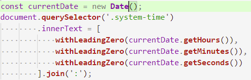

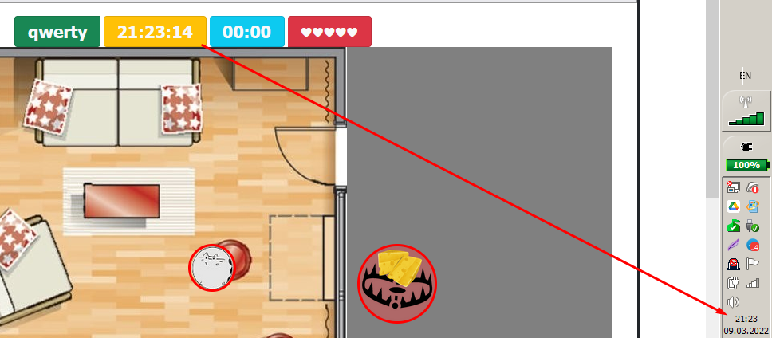

6. Отображение игрока:

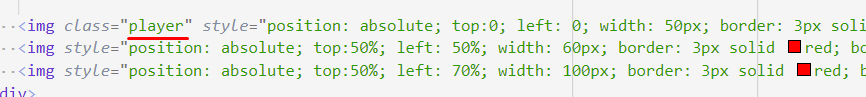

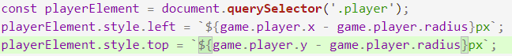

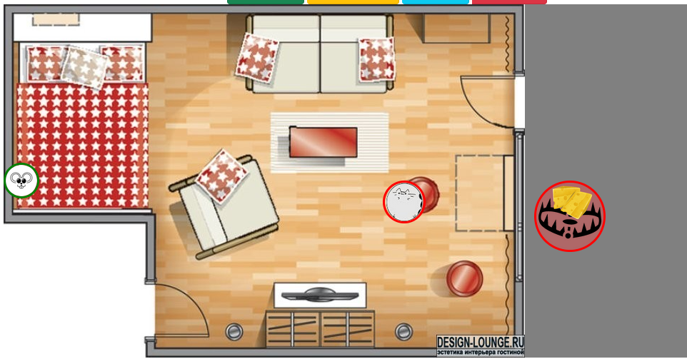

7. Отображение монстров будет аналогично отображению Игрока. Но с нюансом, во-первых монстров и ловушек будет несколько, во-вторых монстры и ловушки будут появляться (случайно) и исчезать (при столкновении), поэтому и HTML узлы должны будут добавляться и удаляться в документ.
Эти механизмы мы рассмотрим на следующих этапах при реализации Монстров и Ловушек.

## Навигация

- [WorldSkills. Модуль 2. Программирование на стороне Клиента](202202150946-WS-module-2.md)
    - Следующее: [Движение Игрока](202203011642-player-move-m2-ws.md)
    - Предыдущее: [Модель/Состояние Игры](202203011636-model-game-m2-ws.md)
