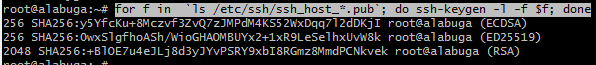

# 202203181629 Как узнать fingerprint SSH-сервера

```bash
for f in  `ls /etc/ssh/ssh_host_*.pub`; do ssh-keygen -l -f $f; done
```

Пример:



Для удаленного сервера, также можно использовать `ssh-keyscan`
