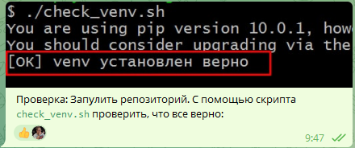
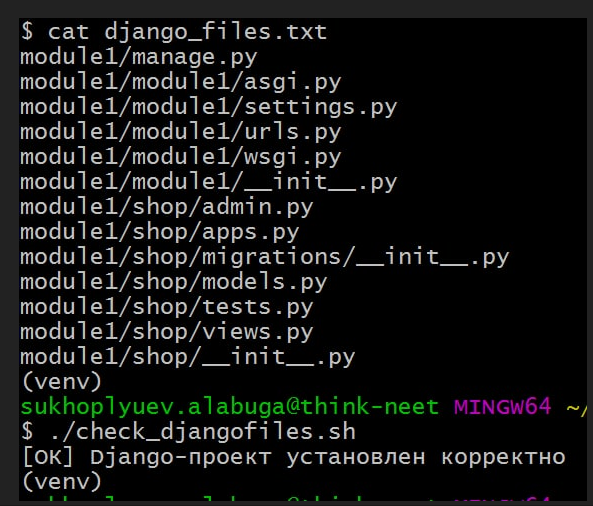
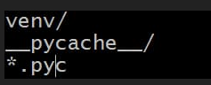
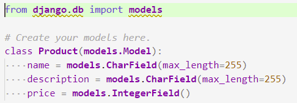
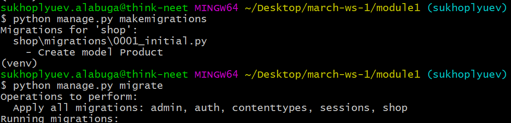
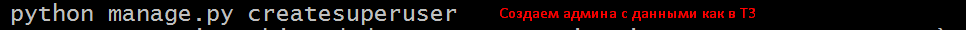
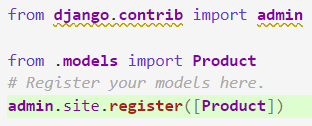
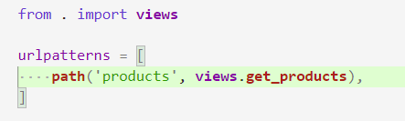
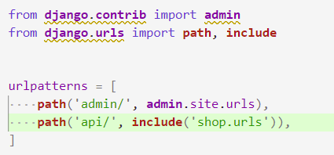
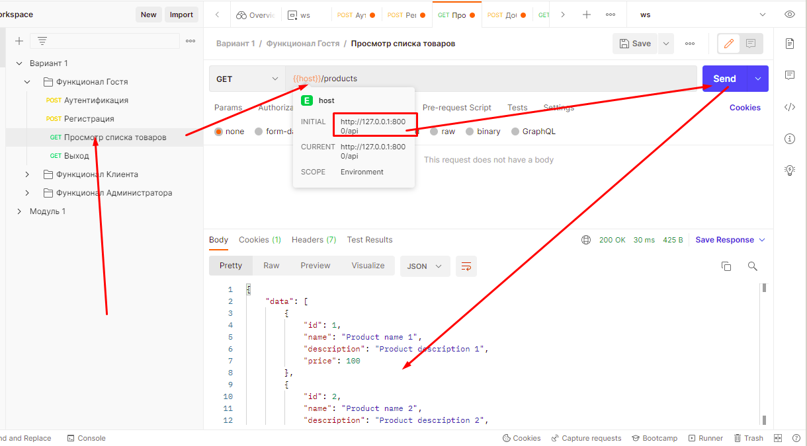

# 202203301225 Разбор 1-го модуля с API

1. склонировать себе git репозиторий, и развернуть виртуальное окружение согласно requirements.txt: `https://gitlab.com/alabuga/firstyearweb/march-ws-1`. Проверка:

2. Задача 2:
    1. Запулить main
    2. Создать Django-проект с именем `module1`
    3. В нем создать Django-приложение с именем `shop`
    4. Должны быть файлы как в файле django_files.txt. Скрипт `check_djangofiles.sh` для проверки

3. Задача 3.
    1. Переключаемся на ветку со своей фамилией
    2. Удаляем из .gitignore `module1`, и добавляем строки по скриншоту
    3. коммитим ваш Django-проект и отправляем на gitlab

4. Задача 4. Сделаем показ Продуктов по /api/products
    1. Создайте в приложении shop, модель Product с необходимыми полями
    2. Сделайте во view функцию get_products(), которая возвращает JSONResponse
    3. Привижите ее в urls.py по пути /api/product
    4. Как все будет готово сделать коммит в своей ветке и запушить

