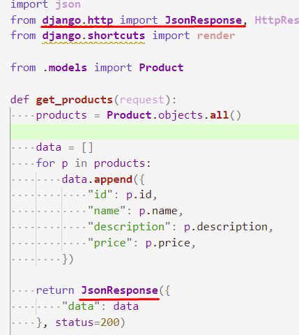

# 202203301225 Разбор 1-го модуля с API

## Задача 1. Разворачивание пакетов с версией по заданию

1. Склонировать себе git репозиторий: `https://gitlab.com/alabuga/firstyearweb/march-ws-1`
2. Развернуть виртуальное окружение согласно requirements.`txt`.
3.Проверка:

## Задача 2: Разворачивание Django-проекта

1. Запулить main (если старая версия)
2. Создать Django-проект с именем `module1`
3. В нем создать Django-приложение с именем `shop`
4. Должны быть файлы как в файле `django_files.txt`
5.Скрипт `check_djangofiles.sh` для проверки:

## Задача 3. Создание Django-проекта

1. Переключаемся на ветку со своей фамилией
2. Удаляем из .gitignore `module1`, и добавляем строки по скриншоту 

3. Коммитим ваш Django-проект и отправляем на gitlab

# Задача 4. Сделаем показ Продуктов по `GET /api/products`

> **Каждый шаг не забываем проверять в Postmane!!!!** 
> [YouTube](https://youtu.be/IHB5LW4VWG8)

1. Создайте в приложении `shop`, модель `Product` с необходимыми полями
2. Сделайте во view функцию `get_products()`, которая возвращает `JsonResponse`
3. Привяжите ее в `urls.py` по пути `/api/product`
4. Как все будет готово сделать коммит в своей ветке и запушить 

## Задача 5. Сделаем Регистрацию по `POST /api/signup`:

> **Каждый шаг не забываем проверять в Postmane!!!!** 
> [Youtube](https://youtu.be/S2rPt07WLyE).

1. Сделаем свою модель пользователя, чтобы не привязываться к Django-Аутентификации  

2. Сделаем проверку на то, что метод обрабатывает только `POST`. Выключим `CSRF-Validatoin` (В REST API это не требуется): 

3. Для возвращения 404 сделаем функцию возвращающую JSON по ТЗ (Для валидации делаем аналогичную функцию):

4. Загрузка тела запроса, как JSON:

5. Валидация
    1. что все обязательные поля не пустые: 
    
    2. Что Email соответствует шаблону: 
    
    
    3. Что email еще не занят: 
    
    4. Что пароль не менее 6-ти символов: 
    
6. Генерация токена
    1. Используем `hashlib` стандартную библиотеку Питона: https://docs.python.org/3.7/library/hashlib.html#hash-algorithms 
    
    
    2. Создаем токен по текущему времени/Имени пользователя и Паролю 
    
    
    
7. Создаем Пользователя в БД (Проверяем в Админке): 

## Задача 6. По аналогии с Регистрацией сделать Аутентификацию пользователя.

- [git-diff](https://gitlab.com/alabuga/firstyearweb/march-ws-1/-/commit/e02dad9a0cf468ff3bc7f6f5492906df5ea3a4e0)

# Задача 7. POST /api/cart/<product_id> - Добавление товара в карзину

- [git-diff](https://gitlab.com/alabuga/firstyearweb/march-ws-1/-/commit/ba590abec33d11c175fe14c04716eef1fba67a42)

# Задача 8. Просмотр корзины

# Задача 9. Удаление товаров из корзины

# Задача 10. POST/GET /api/cart Оформление и просмотр заказа

# Задача 11. GET /logout Выход

# Задача 12. [admin] POST /api/product Добавление товара в список

# Задача 13. [admin] Удаление и редактирование товара

