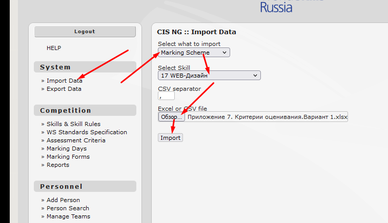

# 202204171323 Проверка WS в CIS

1. https://cis.worldskills.ru/





```
s = [
{second:"", first: ""},
]

function a(i) {
    document.querySelector("[name=firstName]").value = s[i].first;
    document.querySelector("[name=lastName]").value = s[i].second;
    document.getElementById("id174-M-M").checked = true;;
    document.querySelector("[name=addButton]").click();
}

function create(i) {
    a(i)

    document.querySelector("[name=saveButton]").click();
    if (i+1 < s.length) setTimeout(1000, () => create(i+1));
}

```


```
let data = document.querySelectorAll('.tdMarkingScore').forEach(el=>{
    el.value=el.value||0; el.dispatchEvent(new Event('change'))
;})
let data1 = document.querySelectorAll('.subMark').forEach(el=>{
    el.value=0; el.dispatchEvent(new Event('change'))
;})
document.querySelector('[name="saveButton"]').click();
```


